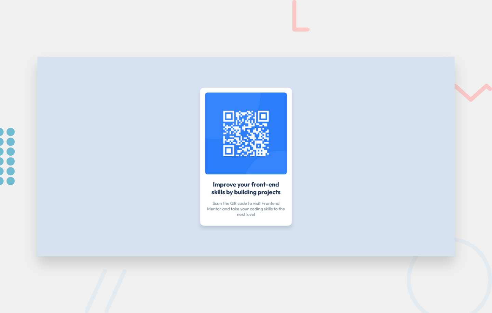

# Frontend Mentor - QR code component solution

This is a solution to the [QR code component challenge on Frontend Mentor](https://www.frontendmentor.io/challenges/qr-code-component-iux_sIO_H). Frontend Mentor challenges help you improve your coding skills by building realistic projects.

## Table of contents

- [Overview](#overview)
  - [Screenshot](#screenshot)
  - [Links](#links)
- [My process](#my-process)
  - [Built with](#built-with)
  - [What I learned](#what-i-learned)
  - [Continued development](#continued-development)
  - [Useful resources](#useful-resources)
- [Author](#author)

## Overview

### Screenshot



### Links

- Solution URL: [Add solution URL here](https://your-solution-url.com)
- Live Site URL: [Add live site URL here](https://your-live-site-url.com)

## My process

### Built with

- Semantic HTML5 markup
- CSS custom properties
- CSS Grid
- Mobile-first workflow

### What I learned

I learnt how to make the width of an element responsive by using css `width` and `min-width` properties.
An example is shown below:

```css
<div class="div">Some Content</div>
```

```css
.div {
  width: 80%;
  max-width: 300px;
}
```

The example above ensures that the width of `.div` will always be `80%` of its parent container.
However, when its size reaches `300px`, it stops growing (this means, it stops taking up 80% of its parent and starts taking up 300px instead).

### Continued development

As of now (28 June, 2023), I realize that I still have a long way to go at mastering responsive designs.

I look forward to mastering it soon.

### Useful resources

- [min(), max(), and clamp() are CSS magic!](https://youtu.be/U9VF-4euyRo) by Kelvin Powell - This video is really helpful if you find it hard to make the width of elements and the font size of texts responsive. You can follow him on YouTube for more CSS tips and tricks.

## Author

- Website - [Add your name here](https://www.your-site.com)
- Frontend Mentor - [@yourusername](https://www.frontendmentor.io/profile/yourusername)
- Twitter - [@yourusername](https://www.twitter.com/yourusername)

**Note: Delete this note and add/remove/edit lines above based on what links you'd like to share.**
